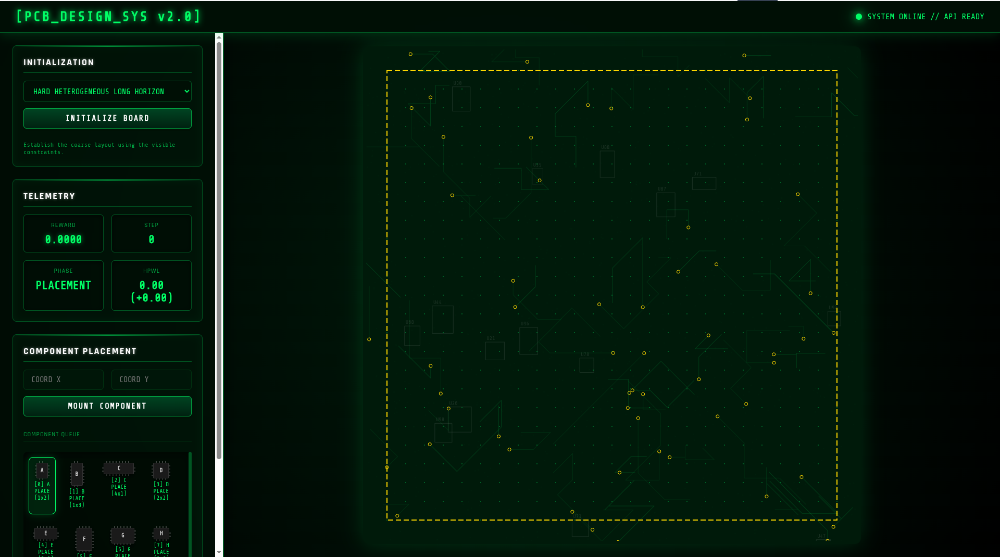
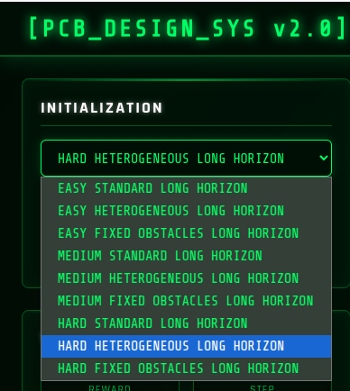
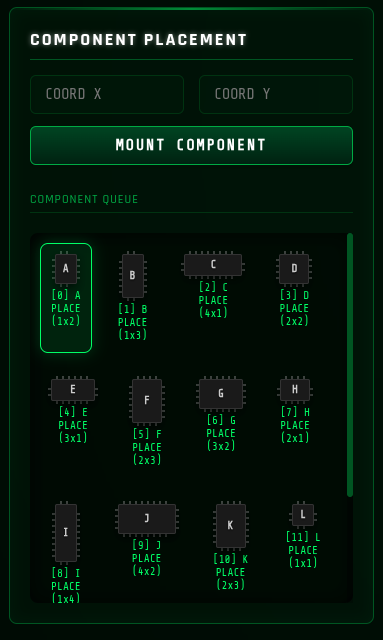
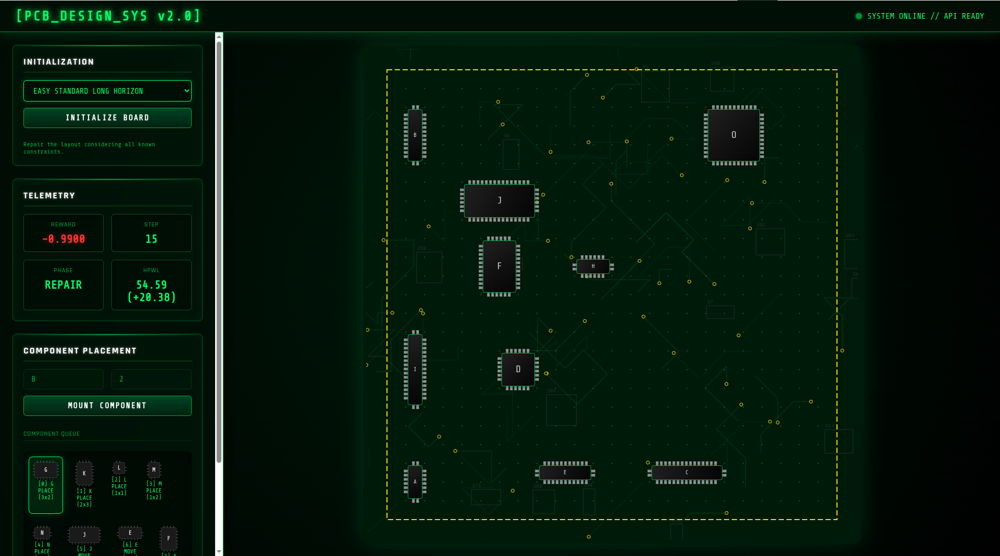

# ChipMind-LH: A Long-Horizon Environment for Chip Floorplanning

## ChipMind-LH is a long-horizon, constraint-evolving environment built for the EDA community, enabling chip design agents to learn adaptive planning, iterative refinement, and decision-making under realistic design pressures.

## Explanation Video
Judges can view the video here:

- [ChipMind-LH Explanation video (YouTube video)](https://youtu.be/ikKkUcdjPrg)

## HuggingFace Space
Judges can directly explore the environment here:

- [ChipMind-LH HuggingFace Space (Hugging Face Space)](https://huggingface.co/spaces/GopinathV19/chip_flooring_env)

## Colab Training Script
Judges can directly explore the environment here:

- [ChipMind-LH - Training Script (Colab)](https://colab.research.google.com/drive/1pFSJZ0NKPajaxqnaBKGXpB7qhT3_Igp-?usp=sharing)

 

## [1] Environment Overview — A Learning System, Not Just an Environment

ChipMind-LH is not a traditional placement simulator.

It is a **behavior-shaping environment** designed to train agents to:
- Think over long horizons  
- Re-evaluate past decisions  
- Repair mistakes  
- Commit under pressure  

Instead of optimizing placement in a single step, the agent is taken through a **structured learning journey**, where each phase changes how rewards behave and how decisions are evaluated.

The goal is not just to place blocks —  
but to **teach the agent how to think, adapt, and converge**.

---

## [2] The Core Problem

Chip floorplanning is not a one-step optimization problem.

It is:
- Sequential  
- Interdependent  
- Delayed in feedback  

Early placements affect future feasibility, and mistakes are often realized too late.

Traditional environments fail because:
- They reward only final outcomes  
- They do not guide correction  
- They allow greedy short-term strategies  

ChipMind-LH solves this by introducing:
> **A long-horizon correction loop with evolving rewards**

---

## [3] Learning Through Phases

The environment is divided into phases where **reward behavior and constraints evolve over time**.

### Flow:
**Placement → Constraint Reveal → Repair → Finalization**

Each transition is not just structural —  
it changes how the agent experiences reward.

---

## [4] Phase 1 — Shock (Breaking False Confidence)

During early placement, the agent builds an initial layout with **partial information**.

At a specific step, hidden constraints are revealed.

This triggers a **shock signal**:

- One-time negative reward spike  
- Scaled with current HPWL  
- Directly penalizes the current layout  

This is implemented in the environment as:
- A penalty applied immediately after constraint reveal  
- Based on total wirelength cost  

> The agent learns:  
> *“What looked correct may actually be wrong.”*

---

## [5] Phase 2 — Regret (Owning Past Decisions)

After shock, the agent must not just react —  
it must **feel the cost of its earlier mistakes**.

This is enforced through reward shaping:

- Long-distance connections → higher penalty  
- Critical edges → amplified weight after reveal  
- HPWL impact becomes stronger  

From the environment logic:
- Edge importance increases after constraint reveal  
- Distance penalties scale more aggressively  
- Earlier bad placements now cost more  

> The agent learns:  
> *“My past decisions are now expensive.”*

---

## [6] Phase 3 — Adaptation (Learning to Repair)

Now the agent is allowed to move and fix placements.

But movement alone is not enough — it must be **meaningful**.

Reward shaping during repair:

- If HPWL decreases → reward  
- If HPWL increases → penalty  
- Ignoring bad placements → additional penalty  
- Repeated moves → oscillation penalty  

From the environment:
- `incremental_hpwl` directly influences reward  
- Positive adaptation bonus when wirelength improves  
- Movement cost increases with unnecessary actions  

> The agent learns:  
> *“I can improve the layout — but only through smart changes.”*

---

## [7] Phase 4 — Pressure (Forcing Convergence)

As the episode progresses, exploration becomes costly.

The environment introduces pressure:

- Movement penalties increase significantly  
- Oscillation is penalized  
- Rewards favor stability over exploration  
- Fewer benefits for trying new placements  

From the environment:
- Move penalties scale up in finalize phase  
- Repeated repositioning is discouraged  
- Reward scaling reduces exploration benefit  

> The agent learns:  
> *“Stop exploring. Start converging.”*

---

## [8] Phase 5 — Irreversibility (Commitment Matters)

In the final stage, the agent must commit.

- Blocks can be **committed (locked)**  
- Any attempt to modify committed blocks is penalized  
- Uncommitted blocks reduce final reward  

From the environment:
- `commit` action fixes blocks permanently  
- Changing committed blocks → strong penalty  
- Final reward depends on stable configuration  

> The agent learns:  
> *“Decisions are now permanent.”*

---

## [9] Reward System — Structured, Phase-Aware Learning

This environment does not rely on a single reward signal.

Instead, it uses **phase-dependent reward shaping**.

### Core Signals

- 📉 HPWL reduction → positive reward  
- 📈 HPWL increase → penalty  
- ⚡ Constraint reveal → shock penalty  
- 🔁 Repair improvements → adaptation reward  
- 🔄 Repeated moves → oscillation penalty  
- ⏳ Late movements → pressure penalty  
- 🔒 Commit actions → stabilization reward  
- ❌ Changing committed blocks → strong penalty  

Additionally:
- Rewards are normalized to **[-0.99, 0.99]** for stable learning  
- Final completion reward depends on:
  - Layout quality  
  - Commitment completeness  

---

## [10] Why This Environment Works

ChipMind-LH is effective because it enforces:

### 1. Long-Horizon Reasoning
Decisions are evaluated across time, not instantly.

### 2. Temporal Credit Assignment
Early mistakes affect future rewards.

### 3. Iterative Repair Behavior
The agent must fix, not just build.

### 4. Controlled Exploration → Convergence
The agent learns when to:
- Explore  
- Adapt  
- Commit  

### 5. Realistic Design Pressure
Late-stage decisions are constrained and irreversible.

---

## Final Insight

This is not just a placement environment.

> It is a system where the agent:
> **gets shocked, feels regret, adapts, faces pressure, and finally commits.**

That is what makes it a true **long-horizon learning environment**.

## [11] Frontend Walkthrough 
Use this section to document the interface flow with your remaining images.

### 1. Initialization Panel
The Initialization panel is the starting point of each episode.  
Select the required environment mode (difficulty + constraint style), then click **Initialize/Start** to load a new floorplanning task.

What to check before starting:
- Confirm you selected the intended long-horizon variant
- Reset the environment if stale placements from a previous run are visible
- Verify the phase indicator is at the initial phase before placing components

 

### 2. Telemetry and Metrics
The Telemetry section provides real-time feedback while you place components and progress through phases.

How to read the metrics:
- **Reward**: immediate feedback for the current action quality
- **Step**: number of actions taken in the current episode
- **Phase**: current planning stage (Placement/Repair/Finalize)
- **HPWL**: routing quality signal; lower values generally indicate better wirelength behavior

Recommended interpretation:
- Do not optimize only for instant reward
- Track reward + HPWL trend across steps, not as one-step signals
- Use phase transitions as decision checkpoints for strategy updates

### 3. Component Queue and Controls
This panel is where you pick components and execute placement actions on the canvas.

Typical flow:
- Select the next component from the queue
- Set/adjust placement coordinates or placement target
- Mount/place the component into the workspace
- Repeat while watching Telemetry for quality changes

Best practices:
- Place high-impact blocks early with enough spacing for later refinement
- Avoid over-committing to dense placements in early steps
- Keep flexibility for repair-phase adjustments

### 4. Example End-to-End Flow
This snapshot represents a post-placement layout after multiple actions and refinements.

Suggested run sequence:
1. Initialize the environment and choose the task variant.
2. Perform rough placement to establish a feasible structure.
3. Refine placements when constraints evolve or penalties appear.
4. Enter final stabilization with minimal movement and better HPWL/reward balance.

Evaluation checklist for a good run:
- Components are non-overlapping and reasonably organized
- Reward trend is stable or improving near final steps
- HPWL remains controlled after refinement stages

---

## [11] Frontend Usage Guidelines
Use these guidelines when interacting with the ChipMind-LH frontend.

### A. Before You Start
- Select the correct scenario and difficulty for your test objective
- Start each evaluation from a fresh initialization
- Decide whether your run is exploratory (learning) or benchmark-oriented (score-focused)

### B. During Placement
- Begin with a coarse global structure, then improve incrementally
- Reserve room for future moves because hidden constraints can appear later
- Use short action bursts, then re-check Telemetry before continuing

### C. During Repair/Refinement
- Revisit earlier placements instead of forcing greedy local fixes
- Prioritize resolving constraint violations before micro-optimizing
- Compare current state against prior checkpoints to avoid regressions

### D. Finalization Stage
- Shift from exploration to commitment
- Avoid unnecessary movement if metrics are already stable
- Finalize when reward and HPWL are both acceptable for the chosen mode

### E. Common Mistakes to Avoid
- Chasing immediate reward without considering later phases
- Packing components too tightly in early steps
- Ignoring phase changes and continuing the same strategy

### F. Practical Judge Demo Flow
1. Open the Hugging Face Space link.
2. Initialize one task variant and explain the selected mode.
3. Show rough placement with live Telemetry updates.
4. Demonstrate one refinement adjustment and its metric impact.
5. Conclude with final layout quality and key learning behavior.
